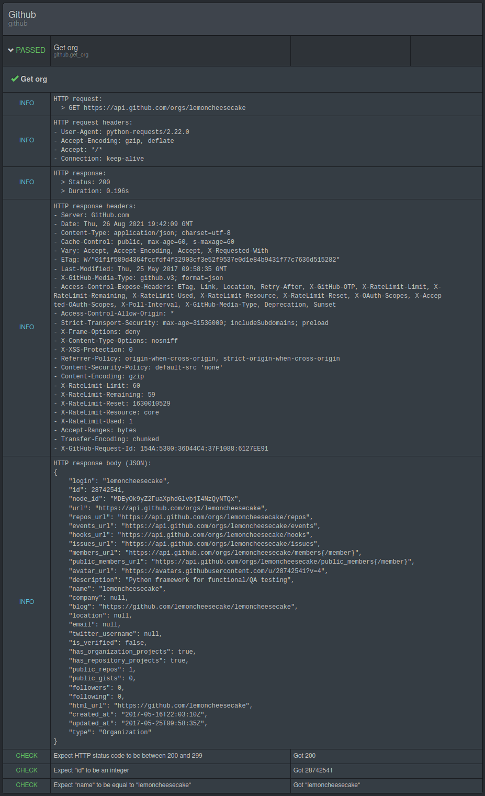

.. lemoncheesecake-requests documentation master file, created by
   sphinx-quickstart on Sun Aug 22 12:49:56 2021.
   You can adapt this file completely to your liking, but it should at least
   contain the root `toctree` directive.

.. _`index`:

lemoncheesecake-requests
========================

lemoncheesecake-requests provides logging facilities to `requests <https://docs.python-requests.org/>`_ for
tests written with the `lemoncheesecake <http://lemoncheesecake.io>`_ test framework.

In this example, we implement a very basic test on a Github API endpoint::

   # suites/github.py

   import lemoncheesecake.api as lcc
   from lemoncheesecake.matching import *
   from lemoncheesecake_requests import Session, is_2xx

   @lcc.test()
   def get_org():
       session = Session(base_url="https://api.github.com")

       resp = session.get("/orgs/lemoncheesecake")
       resp.require_status_code(is_2xx())

       check_that_in(
           resp.json(),
           "id", is_integer(),
           "name", equal_to("lemoncheesecake")
       )

We run the test::

   $ lcc.py run
   =================================== github ====================================
    OK  1 # github.get_org

   Statistics :
    * Duration: 0.214s
    * Tests: 1
    * Successes: 1 (100%)
    * Failures: 0

And here are the report details :

Installation
------------

Install through pip::

   $ pip install lemoncheesecake-requests

lemoncheesecake-requests is compatible with Python 3.6-3.9.

Features
--------

Session
~~~~~~~

lemoncheesecake-requests extends :py:class:`requests.Session` to add logging features through a
:py:class:`lemoncheesecake_requests.Logger` instance.

This logger which can be set session-wide (it is set to :py:func:`Logger.on() <lemoncheesecake_requests.Logger.on>`
by default)::

   session = Session(base_url="https://api.github.com", logger=Logger.no_headers())
   session.get("/orgs/lemoncheesecake")

or overridden on a per request basis::

   session = Session(base_url="https://api.github.com")
   session.get("/orgs/lemoncheesecake", logger=Logger.no_headers())

The :py:attr:`base_url <lemoncheesecake_requests.Session.base_url>` argument is optional and an
extra :py:attr:`hint <lemoncheesecake_requests.Session.hint>` argument is also available to provide more context in the
logs to the report reader.

As you might guess from the previous examples, the logger can be fine tuned to control exactly what HTTP request/response details
that will be logged through the following logger boolean attributes:

- :py:attr:`Logger.request_line_logging <lemoncheesecake_requests.Logger.request_line_logging>`
- :py:attr:`Logger.request_headers_logging <lemoncheesecake_requests.Logger.request_headers_logging>`
- :py:attr:`Logger.request_body_logging <lemoncheesecake_requests.Logger.request_body_logging>`
- :py:attr:`Logger.response_code_logging <lemoncheesecake_requests.Logger.response_code_logging>`
- :py:attr:`Logger.response_headers_logging <lemoncheesecake_requests.Logger.response_headers_logging>`
- :py:attr:`Logger.response_body_logging <lemoncheesecake_requests.Logger.response_body_logging>`

If you want for instance to create a logger that only logs data coming from the response::

   logger = Logger(
      request_line_logging=False
      request_headers_logging=False
      request_body_logging=False
   )

and then pass this logger to a session or to a specific HTTP method call.

The :py:class:`lemoncheesecake_requests.Logger` class also provide class methods to easily create instances for common usage
cases:

- :py:func:`Logger.on() <lemoncheesecake_requests.Logger.on>`
- :py:func:`Logger.off() <lemoncheesecake_requests.Logger.off>`
- :py:func:`Logger.no_headers() <lemoncheesecake_requests.Logger.no_headers>`
- :py:func:`Logger.no_response_body() <lemoncheesecake_requests.Logger.no_response_body>`

HTTP request bodies and especially response bodies might be very large and make the final report unreadable.
That's why the logger will log the request/response bodies as attachment if their (serialized) content size
exceed a certain size. This size can be configured through the
:py:attr:`max_body_size <lemoncheesecake_requests.Logger.max_body_size>` logger attribute.

Response
~~~~~~~~

The various request-methods (``get()``, ``post()``, etc...) of :py:class:`lemoncheesecake_requests.Session` return a
:py:class:`lemoncheesecake_requests.Response` which extends :py:class:`requests.Response` and provides several
extra methods to check the response status code.

As you may already know, lemoncheesecake provides three different way (for three different behaviors) to perform a
matching operation:

- :py:func:`lemoncheesecake.matching.check_that`
- :py:func:`lemoncheesecake.matching.require_that`
- :py:func:`lemoncheesecake.matching.assert_that`

The :py:class:`lemoncheesecake_requests.Response` follows the same logic by offering the corresponding three methods:

- :py:func:`Response.check_status_code(expected) <lemoncheesecake_requests.Response.check_status_code>`
- :py:func:`Response.require_status_code(expected) <lemoncheesecake_requests.Response.require_status_code>`
- :py:func:`Response.assert_status_code(expected) <lemoncheesecake_requests.Response.assert_status_code>`

Where ``expected`` can be either an :py:class:`int` or a :py:class:`Matcher <lemoncheesecake.matching.matcher.Matcher>`
instance, so that the following statements are all valid::

   resp.check_status_code(200)
   resp.check_status_code(equal_to(200))
   resp.check_status_code(any_of(200, 201))

lemoncheesecake-requests provides the :py:func:`is_2xx() <lemoncheesecake_requests.is_2xx>`,
:py:func:`is_3xx() <lemoncheesecake_requests.is_3xx>`, :py:func:`is_4xx() <lemoncheesecake_requests.is_4xx>`,
:py:func:`is_5xx() <lemoncheesecake_requests.is_5xx>` matchers to check status code family::

   resp.check_status_code(is_2xx())

There is also an alternative way to check status code, that is not built uppon lemoncheesecake's logging facilities:
:py:func:`Response.raise_unless_status_code(expected) <lemoncheesecake_requests.Response.raise_unless_status_code>`
will directly
raise a :py:class:`StatusCodeMismatch <lemoncheesecake_requests.StatusCodeMismatch>` exception if the condition is not met
and then interrupt the test (unless the exception is explicitly caught)::

   resp.raise_unless_status_code(200)

(this function can also take a :py:class:`Matcher <lemoncheesecake.matching.matcher.Matcher>` instance as argument).

All these methods have a corresponding shortcut method that directly check a 2xx status code:

- :py:func:`Response.check_ok() <lemoncheesecake_requests.Response.check_ok>`,
- :py:func:`Response.require_ok() <lemoncheesecake_requests.Response.require_ok>`
- :py:func:`Response.assert_ok() <lemoncheesecake_requests.Response.assert_ok>`
- :py:func:`Response.raise_unless_ok() <lemoncheesecake_requests.Response.raise_unless_ok>`

It means that those two method calls are equivalent::

   resp.check_status_code(is_2xx())
   resp.check_ok()

Please note that all these extra methods return the ``Response`` instance itself, meaning that they can be chained like
this::

   resp = session.get("/orgs/lemoncheesecake").require_ok()

See the :ref:`API Reference<api>` for full details about the lemoncheesecake-requests API.

Changelog
---------

The |location_link| will tell you about features, improvements and fixes of each version.

.. |location_link| raw:: html

   <a href="https://github.com/lemoncheesecake/lemoncheesecake-requests/blob/master/CHANGELOG.md" target="_blank">Changelog</a>
